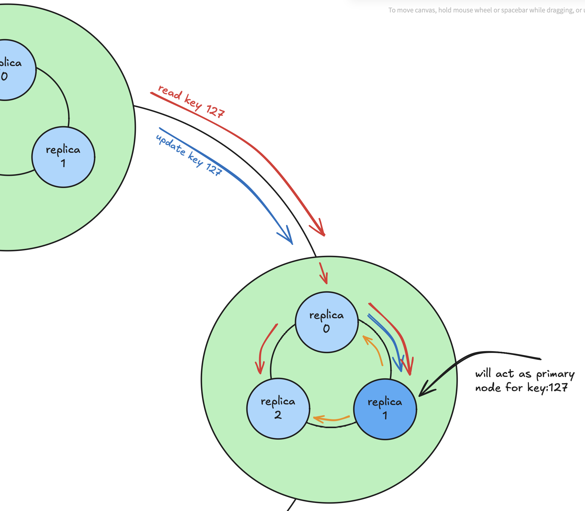

Over the past few months, I've been diving deep into distributed storage internals — and somewhere along the way, **OrangeDB** was born. If you haven't heard of it yet, check [orange](). This journey led me to explore several lesser-known databases that quietly power critical infrastructure in production environments.

Some highlights:

- **Cassandra** — a fully leaderless, highly available system with tunable consistency.
- **MongoDB** — a semi-consistent document store with sharding and replica sets.
- **LevelDB / RocksDB** — high-performance embedded key-value stores.
- **Voldemort / Riak** — early pioneers in distributed key-value stores.

###  Revisiting Existing Designs

#### **Cassandra**

Cassandra is completely **leaderless** — any node can handle reads or writes. Data is eventually replicated using **gossip**. To ensure consistency, Cassandra uses **tunable quorum reads and writes**:

- For a cluster with `n` replicas:
  - A **write** must be acknowledged by at least `w` nodes.
  - A **read** must be satisfied by `r` nodes.
  - The constraint `w + r > n` ensures **strong consistency**.

Features like **sloppy quorum**, **hinted handoff**, and **read repair** further enhance availability. However, this design may result in **higher read and write latencies**, especially under quorum settings.

#### **MongoDB Sharded Deployment**

In a MongoDB sharded cluster:

- The dataset is partitioned across **shards**.
- Each shard is a **replica set** with a single **primary** and multiple **secondaries**.
- All writes go to the **primary** of the relevant shard.
- Reads can be routed to the **primary** or to secondaries depending on the configured read preference.

This design offers **strong consistency by default** (via the primary) and **lower read latency** in relaxed consistency modes. However, it relies heavily on **leader election (via Raft)**, which introduces complexity (e.g., split-brain handling, election delays, leadership failover).

---

### Enter OrangeDB

OrangeDB attempts to combine the **best of both worlds**:

- The **scalability and partitioning** of MongoDB’s sharded setup.
- The **leaderless replication** and tunable consistency of Cassandra.

It introduces:

> #### “Consistent Ring Within a Consistent Ring”

- An **outer ring** of nodes forms the basis for **shard selection** via consistent hashing.
- Each shard contains an **inner ring** of **replica nodes**, also organized using consistent hashing.

This two-layer ring structure enables **fine-grained control** over placement, replication, and load distribution.

---

### Write Path

1. For a key like `k=120`, OrangeDB hashes the key to determine the target **shard** via the **outer ring**.
2. Within that shard, the key is again hashed to select a specific **replica** (let’s say `replica-1`) in the **inner ring**.
3. All writes for that key go to this designated **primary replica** — without any leader election.
4. That replica then **asynchronously replicates** the write to its sibling replicas within the shard using **gossip-style replication** (similar to Cassandra).

This design achieves:

- **Write locality** per key.
- **Leaderless writes** without the overhead of leader elections.
- **Horizontal scalability** by sharding at both levels.

---

### Read Path

Reads can be performed at **multiple consistency levels** depending on the use case:

- A **read** first determines the target shard and replica (as with writes).
- Based on the configured consistency level, the system will:
  - Query **only the primary replica**, or
  - Query **a quorum of replicas**, or
  - Query **all replicas** and enforce unanimous agreement.

---

### Read Consistency Levels

OrangeDB supports three read modes:

##### _`all`_
- Queries **all replicas** of a shard.
- Requires **unanimous agreement** on the value.
- **Strongest consistency**, but higher latency.
- Fails if any replica is out of sync.

##### _`quorum`_
- Queries all replicas, but only a **majority** need to agree.
- Balances **availability and consistency**.
- Can optionally trigger **read repair** for divergent replicas.

##### _`single`_
- Reads from the **designated primary replica** only.
- Fastest option, but assumes the primary is **available and up-to-date**.
- Risks **stale reads** or **data loss** if the replica is unavailable.

---

### What OrangeDB Tries to Solve
###### OrangeDB vs Cassandra: Simpler, Lower-Latency Writes

> OrangeDB avoids quorum-based writes by routing each key to a fixed replica, requiring no coordination during writes.

**Why it matters:**

- Cassandra needs coordination between `w` replicas (e.g., 2 of 3) for every write.
- OrangeDB writes to a single replica and replicates asynchronously — lower latency, less overhead.

**Trade-off:** Potential for data loss if the primary fails before replication. No immediate durability like Cassandra’s quorum model.

---

###### OrangeDB vs MongoDB: No Leader Election, Always Writable

> OrangeDB removes the concept of a primary per shard, avoiding Raft-based elections and their downtime.

**Why it matters:**

- MongoDB pauses writes during primary failover and risks split-brain under partitions.
- OrangeDB uses deterministic key-to-replica mapping — no election, no downtime.

**Trade-off:** Requires smarter client or routing logic to handle failed replicas gracefully.

---

---

### Final Thoughts

OrangeDB started as a personal exploration—an educational project driven by curiosity about how distributed storage systems work under the hood. It’s a playground to experiment with ideas inspired by Cassandra, MongoDB, and others, but rethinking some of their core trade-offs.

This project is far from production-ready. There are still many unanswered questions around durability, failure handling, and consistency guarantees. But that’s part of the fun—learning by building and seeing what challenges arise.

If you’ve enjoyed this peek into the inner workings of distributed databases, I hope it sparks your own experiments and deep dives. At the end of the day, OrangeDB is just one step in an ongoing journey to understand and improve how I store and manage data at scale.

Thanks for reading and sharing the curiosity! ✌️
